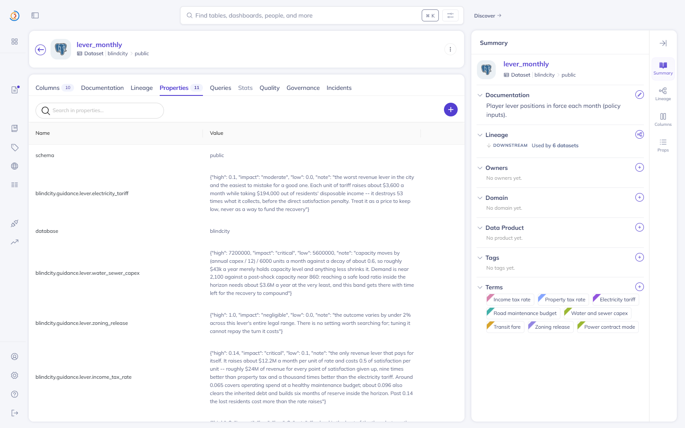
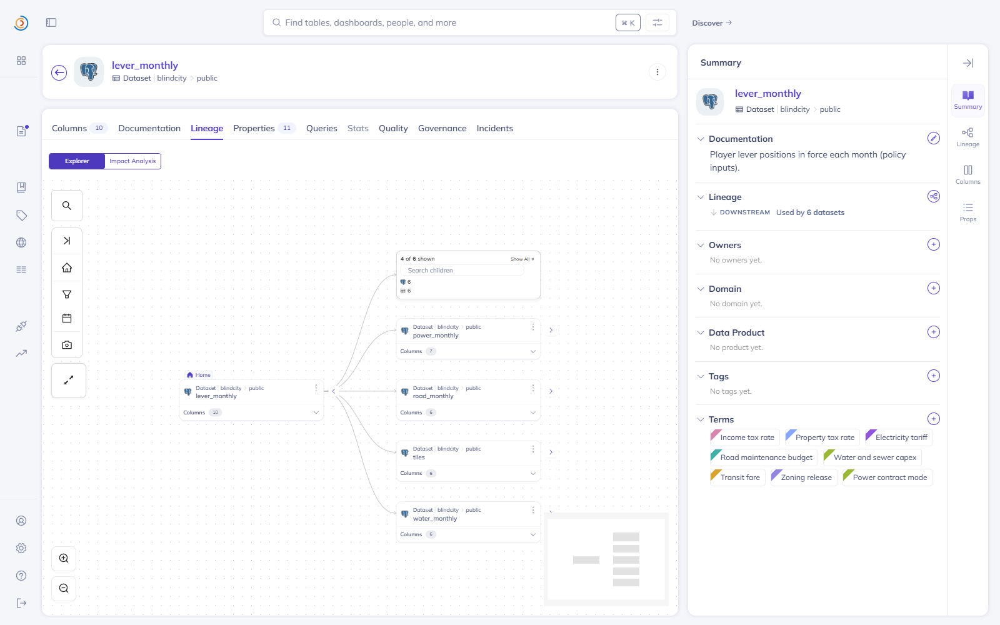
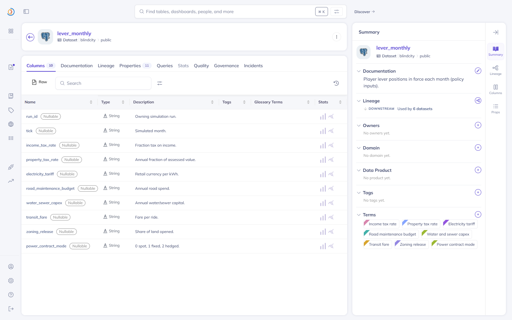
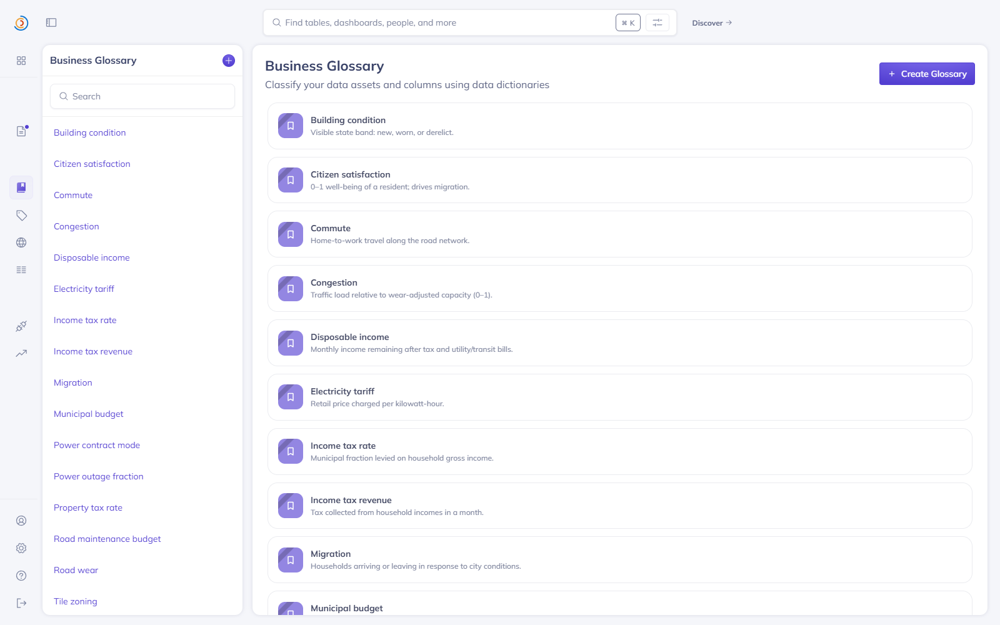
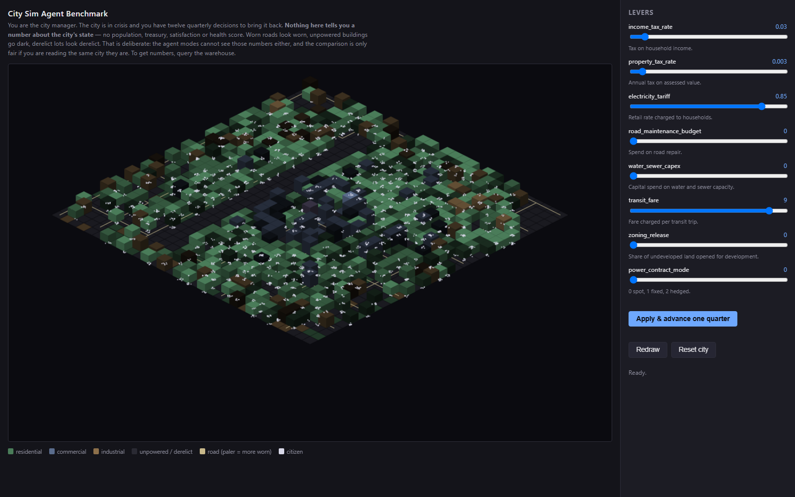
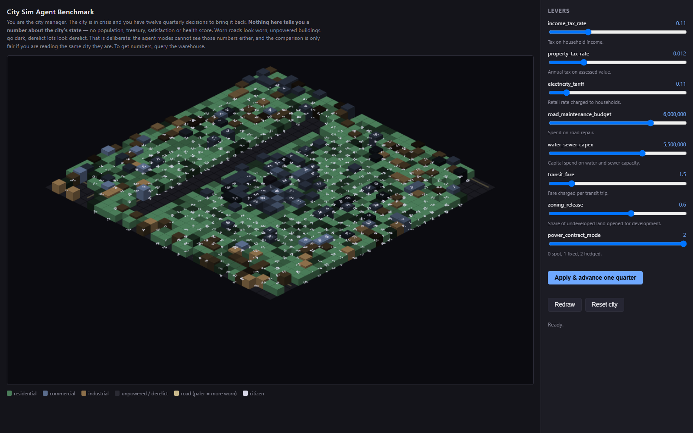

# City Sim Agent Benchmark


**A benchmark for whether data catalogs make AI agents better at their job.**

Built for [Build with DataHub: The Agent Hackathon](https://datahub.devpost.com/).

A city simulation runs, writing hundreds of thousands of rows into Postgres — citizens, households,
roads, power, water, budget, month by month. Then the city is put into a crisis, and an agent is
asked to get it out using eight policy levers and twelve quarterly decisions.

The agent never sees the city. It can only query the warehouse. What changes between runs is **how
much DataHub tells it about that warehouse** — and this measures what that is worth.

---

## The result

Same model, same seed, same crisis, same levers, same turn budget. The only difference is what
DataHub gave each agent.

Seed 42, `gpt-5.6-luna` at reasoning effort `low`, **three runs per agent mode**, reported as means.

| Mode | What the catalog provides | Index | Spread | Green by | SQL queries |
| --- | --- | ---: | ---: | ---: | ---: |
| `agent_raw` | Nothing. Schema discovery via `information_schema` only | 0.6416 | 0.0238 | 9, 7, 9 | 64 |
| `agent_datahub` | Descriptions, glossary, column-level lineage | 0.7413 | 0.0710 | 6, 5, 6 | 52 |
| `agent_datahub_live` | The above, plus assertions read from DataHub each turn | **0.8092** | 0.0175 | **3, 4, 3** | **16** |
| `agent_analytics` | DataHub's own Analytics Agent answers instead | 0.8017 | 0.0554 | 4, 3, 4 | — |
| *`good_policy`* | *hand-calibrated reference, not an agent* | *0.8132* | *—* | *turn 4* | *—* |
| *`bad_policy`* | *deliberate neglect, not an agent* | *0.3244* | *—* | *never* | *—* |

Green is 0.62. All twelve agent runs recovered, and the predicted ordering held on every one of the
three paired rounds, not just on the means.

**The fully-catalogued agent matched a hand-calibrated expert policy, reached green a turn sooner,
and did it on a quarter of the queries — and fewer tokens — than the uncatalogued control.**

The reference rows reproduce in about a minute and need no API key:

```bash
uv run blindcity run --mode good_policy --out results/good.json
uv run blindcity run --mode bad_policy  --out results/bad.json
uv run blindcity compare "results/*.json"
```

### Both catalog steps clear the noise

The interesting result is not "catalogs help." It is that **each step of catalog quality buys a
separate, measurable step of performance**, and at three runs a side neither pair of ranges
overlaps:

| Step | Range below | Range above | Gap between means |
| --- | --- | --- | ---: |
| Descriptions, glossary, lineage | 0.6330 – 0.6568 | 0.7135 – 0.7846 | **0.0997** |
| Assertions, read live from DataHub | 0.7135 – 0.7846 | 0.8004 – 0.8179 | **0.0679** |

The best uncatalogued run scored below the worst catalogued one, and the best merely-described run
scored below the worst asserted one.

- **Descriptions and lineage are worth more than they look.** Relationships the data cannot show
  are where lineage earns its keep: every lever is constant across the recorded history, so no
  amount of querying reveals that `income_tax_rate` drives `income_tax_revenue`. The catalog is the
  only place that relationship exists.
- **Assertions buy consistency, not just score.** `agent_datahub` is the *least* consistent mode in
  the table — 0.0710 of spread against `agent_datahub_live`'s 0.0175. Descriptions tell the agent
  what a column means and leave it to decide what to do; assertions tell it what good looks like,
  and the runs converge.
- **The catalogued agent won on less of everything.** 16 SQL queries against 64, 17 model calls
  against 28, and fewer tokens than the uncatalogued control. A mode that scored higher by querying
  more would just be a mode given more compute. This one stopped searching because it was told
  where to look.

For a data platform team the practical reading is: documenting your columns is worth doing, and
documenting what *good* looks like is worth doing next.

---

## What DataHub holds

The catalog is authored as code and published to DataHub, which then serves it to the agent at run
time. Nothing below is hand-entered in the UI.

### Operating guidance as custom properties

Each lever carries a band, an impact rating, and a note explaining the trade in the city's own
units. This is the metadata behind the 0.7413 → 0.8092 step, and it is read back out of DataHub at
run time rather than imported — `agent_datahub_live` contains none of it, and a test asserts that
structurally.

In `agent_analytics` it goes further: DataHub's own Analytics Agent is told only *where* the
guidance lives and which catalog tool fetches it, then goes and gets it with its own tools. It read
the guidance on **12 of 12 turns in all three runs**, and scored 0.8017 — statistically level with
our purpose-built catalogued agent. That is the whole claim closing end to end, with none of our
values in the prompt.



### Column-level lineage, generated from the simulation

29 column-level edges, emitted from the simulation's declared causal graph. Every edge is proven by
experiment in `blindcity.sim.causal_check` before it ships, so "derived from" is a demonstrated
dependency rather than a claim.



### Schema and business glossary

Every column documented, and every city concept defined once in the glossary and attached to the
columns that mean it.





---

## How it is a benchmark

The city is the substrate, not the deliverable. A **scenario** puts it into a crisis (five years of
deferred maintenance plus a fiscal shock); a **controller** pulls levers over twelve quarterly
turns; a **composite health index** — solvency, satisfaction, service, population retention —
scores whether it recovered.

Five controllers face an identical seed, crisis, and turn budget:

| Mode | Who decides | What they can see |
| --- | --- | --- |
| `human` | You | The city render, the levers, and the Analytics Agent to ask questions |
| `agent_raw` | Our agent | SQL against the warehouse. No catalog |
| `agent_datahub` | Our agent | The same, plus DataHub descriptions, glossary and lineage |
| `agent_datahub_live` | Our agent | The same, plus assertions evaluated against the city each turn |
| `agent_analytics` | DataHub's Analytics Agent | It decides how to answer; it reads DataHub and the warehouse itself |

The three `agent_*` modes above `agent_analytics` are **one implementation instantiated three
times**. There is no `if mode ==` anywhere in the loop, and `tests/test_agent.py` fails the build if
the prompts, tools or turn messages differ by anything other than the catalog block. That is what
makes "they differ in exactly one thing" a property of the code rather than a promise in a document.

### Fairness is enforced by tests

- **No mode is told the scoring function.** Not the index, not its components, not the threshold.
  An agent that knew the weights would optimise the metric instead of fixing the city.
- **No city-state numbers appear in any prompt.** Population, treasury and satisfaction are
  discoverable only through SQL.
- **The viewer shows no numbers either.** Worn roads look worn; unpowered buildings go dark. That is
  information parity with the agent modes, not a style choice.
- **Every run starts from an empty warehouse**, so no run inherits another's rows or planner
  statistics.
- **Every mode runs the same model at the same reasoning effort**, including the Analytics Agent in
  its own service — `preflight()` checks it at run time and refuses to score a mismatch.
- **Assertions are derived from the simulation's own mechanics** and re-derived by
  `tests/test_operational_assertions.py`, which fails if a documented band stops matching what the
  code does. They state operating ranges and response times; they never name a lever to pull.

---

## The human mode

The same crisis, the same seed, the same twelve quarterly turns, played by a person and scored by
the same harness.

```bash
uv run blindcity run --mode human --out results/human.json
```

That prepares exactly what an agent run prepares — warehouse cleared, the crisis written month by
month, the catalog published — then serves the city and gets out of the way. Every lever change and
every turn comes from the browser. Two windows:

| | |
| --- | --- |
| **localhost:8000** | the city and the eight levers |
| **localhost:8100** | the Analytics Agent, to ask the city questions |

The scene carries condition and density but no measurements. To get a number you ask the Analytics
Agent, exactly as `agent_analytics` does. A help panel explains the goal and the scoring on first
load, and the `?` button brings it back.

| Neglected | Recovering |
| --- | --- |
|  |  |

---

## Setting it up from a clean clone

### 1. Install the prerequisites

| Program | Why | Install |
| --- | --- | --- |
| **Docker Desktop** (or Docker Engine + Compose v2) | DataHub Core and the warehouse both run in containers | [docker.com](https://www.docker.com/products/docker-desktop/) |
| **Python 3.11 or 3.12** | The project targets `>=3.11,<3.13` | comes with `uv`, below |
| **`uv`** | Dependency and virtualenv management, and the test runner | [docs.astral.sh/uv](https://docs.astral.sh/uv/getting-started/installation/) |
| **`git`** | To clone this repository | [git-scm.com](https://git-scm.com/downloads) |
| **DataHub CLI** (`acryl-datahub`) | Brings up DataHub Core with one command | `uv tool install --python 3.11 "acryl-datahub[datahub-rest]"` |

Hardware: 16 GB RAM and 25 GB free disk. DataHub Core is six containers, and the warehouse is a
seventh.

An **OpenAI API key** is needed only for the four `agent_*` modes. The simulation, the catalog, the
viewer, and the `good_policy` / `bad_policy` reference runs all work without one.

### 2. Clone and install

```bash
git clone https://github.com/sp-entertainment/contest-datahub-city-sim.git
cd contest-datahub-city-sim
uv sync --group dev
uv run pytest -q          # confirms the install; needs no Docker and no key
```

### 3. Bring up DataHub and the warehouse

```bash
datahub docker quickstart                                    # DataHub UI :9002, GraphQL :8080
docker compose -f infra/postgres/docker-compose.yml up -d    # warehouse Postgres :5432
```

DataHub's UI signs in with `datahub` / `datahub`. On Windows,
`powershell -ExecutionPolicy Bypass -File infra/stack.ps1` starts everything in dependency order and
verifies each endpoint answers; `-Status` reports without changing anything.

### 4. Configure

```bash
cp .env.example .env
```

Fill in `LLM_API_KEY` if you intend to run an agent mode. Every other value already matches the
containers started above. `.env` is gitignored — keys belong in it and nowhere else.

### 5. Generate a city, and look at it

```bash
uv run blindcity sim --seed 42 --years 20    # writes the city's history to the warehouse
uv run blindcity emit                        # publishes the catalog to DataHub
uv run blindcity sim --serve                 # viewer and lever panel on :8000
```

Open <http://localhost:8000> for the city, and <http://localhost:9002> for the catalog behind it.

### 6. Run the benchmark

```bash
uv run blindcity run --mode good_policy --out results/good.json    # no API key needed
uv run blindcity run --mode agent_datahub_live --out results/run.json
uv run blindcity compare "results/*.json"
```

`docs/ENVIRONMENT.md` has the verified command-by-command setup, the container map, and the
lifecycle commands for stopping and restarting the stack.

### Running `agent_analytics`

This mode delegates the analysis to DataHub's own Analytics Agent, which runs as a separate
service. `infra/analytics-agent/README.md` covers standing it up: clone upstream, apply the
reasoning-model branch, drop in the two config files from that directory, and bring it up on
`:8100`.

---

## Commands

One entry point, four subcommands. `blindcity <command> --help` for the full list of flags.

| Command | What it does |
| --- | --- |
| `blindcity sim` | Generate a city's history into the warehouse, or `--serve` the viewer |
| `blindcity emit` | Publish the catalog snapshot to DataHub; `--check` reports differences |
| `blindcity run` | Play one mode of the scenario |
| `blindcity compare` | Summarise result files into one table. Runs nothing |

There is deliberately **no `--repeat`**. Repeats are a shell loop, which needs no feature and keeps
every parameter reachable inside it:

```bash
for i in 1 2 3; do
  for m in agent_raw agent_datahub agent_datahub_live agent_analytics; do
    uv run blindcity run --mode $m --out results/official/$m-$i.json --overwrite-datahub true
  done
done
for m in good_policy bad_policy; do
  uv run blindcity run --mode $m --out results/official/$m.json --overwrite-datahub true
done
uv run blindcity compare "results/official/*.json" --out docs/comparison.md
```

Three things that loop does on purpose:

- **Writes to its own directory.** `results/` also holds ad-hoc runs, so comparing
  `results/*.json` would fold them into the official table.
- **Includes the scripted rows.** `good_policy` and `bad_policy` call no model and cost nothing,
  and the agent scores read much better with a reference either side of them.
- **Passes `--overwrite-datahub true`.** Without it the run stops to ask, and an unattended batch
  stops with it.

That loop is what produced the table at the top of this file. It takes about 40 minutes, most of it
`agent_analytics`, and a completed batch **replaces every recorded number in the repository** —
`docs/RESULTS.md`, the headline figures here, and the contents of `results/official/`.

Every agent run writes a full transcript beside its results: the system prompt, the complete
conversation as the model received it, and every reply.

### DataHub is the authoritative copy

`blindcity run` publishes the catalog before playing, so the metadata the agent reads matches the
commit it is played from and a fresh clone works with no setup. But DataHub is editable, and
widening a band in the UI to see how the agent responds is a thing you are *meant* to be able to
do. So publishing looks before it writes:

```bash
uv run blindcity run --mode agent_datahub_live                           # asks, if anything differs
uv run blindcity run --mode agent_datahub_live --overwrite-datahub true  # replace, no question
uv run blindcity run --mode agent_datahub_live --overwrite-datahub false # keep your edits, run on them
```

When DataHub is empty or already matches, the snapshot is published either way. Every run records
which copy of the guidance it acted on, and a fingerprint of it, in `catalog_source` in its
`.agent.json`.

---

## Architecture

```
sim ──rows──────────────>  Postgres  <──read-only SQL──┐
 │                             ▲                       │
 │                             │ per-run views         │
 └──generated lineage───>  DataHub  ──catalog block──>  agent  ──levers──> sim
                              ▲
                              └── assertions, evaluated each turn
```

Each run gets a private schema of views filtered to its own `run_id`, with `search_path` pointed at
it, so run isolation is structural rather than remembered. The catalog is authored in
`src/blindcity/catalog/`, published to DataHub over its GraphQL and ingestion APIs, and read back
at run time — DataHub is the serving layer, not a mirror of a local file.

---

## Built on DataHub

| Project | Used for |
| --- | --- |
| [datahub-project/datahub](https://github.com/datahub-project/datahub) | DataHub Core. The catalog is published to its ingestion API and read back over GraphQL at run time; `datahub docker quickstart` brings up the whole stack |
| [datahub-project/analytics-agent](https://github.com/datahub-project/analytics-agent) | The `agent_analytics` mode. Runs as its own service and answers the controller's questions from DataHub plus the warehouse |

### Contributed upstream

[**datahub-project/analytics-agent#97**](https://github.com/datahub-project/analytics-agent/pull/97)
— *support OpenAI reasoning models via the Responses API.* The Analytics Agent built its OpenAI
client with no way to set the reasoning budget, so it always called `/v1/chat/completions`, where
the `gpt-5.6-*` family refuses function tools unless reasoning is switched off entirely. The change
adds an `OPENAI_REASONING_EFFORT` setting that routes through `/v1/responses` and passes the effort
down, in one factory that all four model tiers already share. Details and the live verification are
in `infra/analytics-agent/README.md`.

---

## Documentation

- `AGENTS.md` — vision, constraints, project map, conventions (`CLAUDE.md` links here)
- `docs/RESULTS.md` — the full comparison and method
- `docs/FEATURES.md` — what the project does, feature by feature
- `docs/ENVIRONMENT.md` — verified setup, running topology, lifecycle
- `docs/DECISIONS.md` — why it is built this way
- `docs/ERRORS.md` — the engineering log
- `CONTRIBUTING.md` — the project's status, and how to fork it

## License

Apache 2.0. See `LICENSE`.
